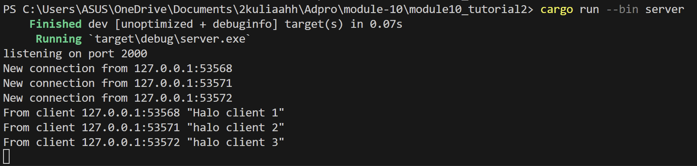
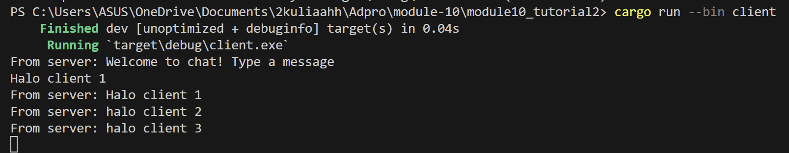
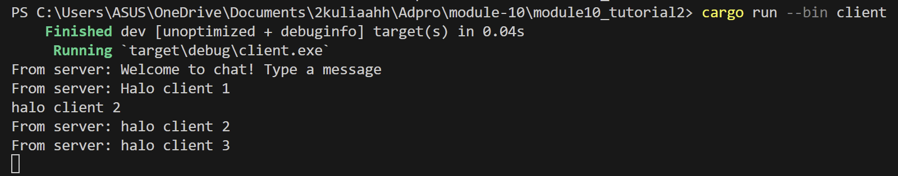
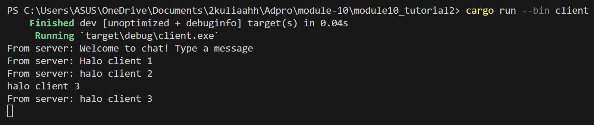

## 2.1. Original code of broadcast chat.




<br>
membuka 4 terminal dan menjalan kan 1 server dan 3 client. <br>
jalankan server dengan ```cargo run --bin server``` <br>
jalankan client dengan ```cargo run --bin client ``` <br>
Gambar tersebut memunculkan bahwa setiap client menerima ketiga message yang dikirimkan ke server.