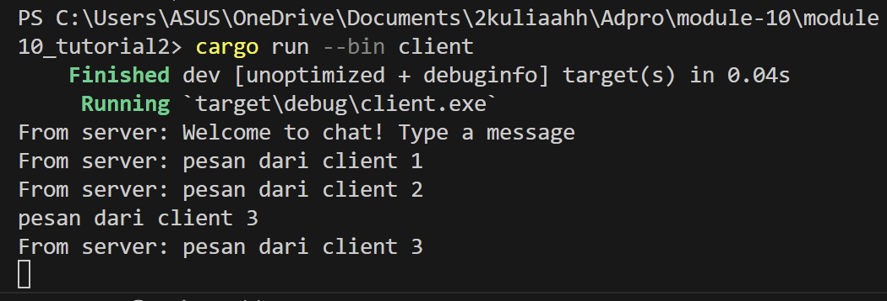

## 2.1. Original code of broadcast chat.


<br>
membuka 4 terminal dan menjalan kan 1 server dan 3 client. <br>
jalankan server dengan ```cargo run --bin server``` <br>
jalankan client dengan ```cargo run --bin client ``` <br>
Gambar tersebut memunculkan bahwa setiap client menerima ketiga message yang dikirimkan ke server.

## 2.2 Modifying the websocket port



<br>
Pada gambar di atas saya merubah port pada server.rs dan juga client.rs makanya mereka dapat menerima message. Namun jika pada client.rs tidak diganti maka akan memunculkan error karena otomatis disconnect dengan server karena alamat port yang berbeda.

## 2.3 Small changes. Add some information to client


<br>
Dengan modifikasi kecil tersebut, dapat dimunculkan dari IP mana message tersebut dikirimkan. Ini dilakukan dengan menambahkan pada bcast.tx.